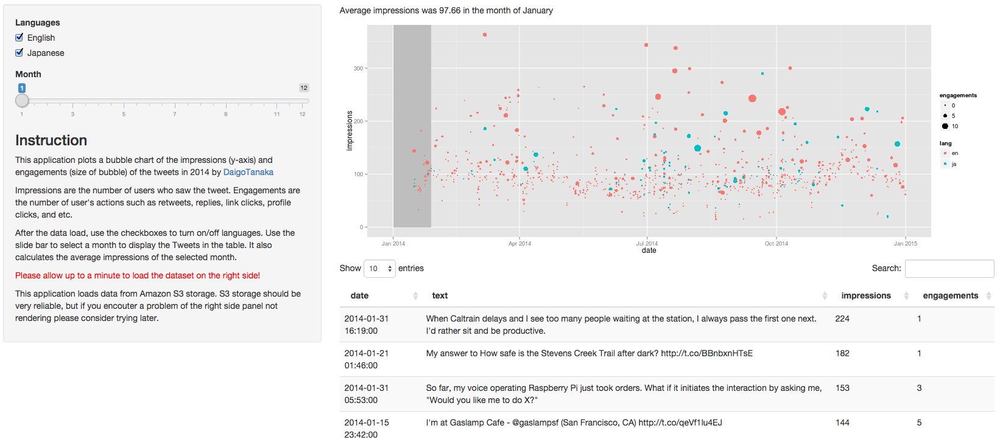

```{r, echo=FALSE, message=FALSE, warning=FALSE, cache=FALSE}
library(RCurl)
library(ggplot2)

# Load Tweets with meta data
url = getURL("https://s3-us-west-1.amazonaws.com/daigotanaka-data/daigotanaka-tweets-2014.csv", .encoding="UTF-8")
tweets = read.csv(text=url, head=TRUE, stringsAsFactors=FALSE)
# tweets = read.csv("/Users/daigo/Documents/essays/daigotanaka-tweets-2014.csv", header=TRUE)
# Load CSV
url = getURL("https://s3-us-west-1.amazonaws.com/daigotanaka-data/tweet-activity-metrics-daigotanaka-2014.csv", .encoding="UTF-8")
metrics = read.csv(text=url, head=TRUE, stringsAsFactors=FALSE)

# Change the column name from Tweet.id to id
col_names = names(metrics)
col_names[1] = "id"
colnames(metrics) = col_names

# Remove outliers and an error entry
metrics = metrics[is.numeric(metrics$impressions)
                  & metrics$impressions > 0
                  & metrics$id != 513495667927711744,]

dataRaw = merge(x=tweets, y=metrics, by="id", all=F)

# For visualization purpose, just take tweets with 200 <= impressions <= 400
data = dataRaw[200 <= dataRaw$impressions
            & dataRaw$impressions <= 400
            & (dataRaw$lang == "en" | dataRaw$lang == "ja"),]


data$date = as.POSIXlt(strptime(as.character(data$time), "%Y-%m-%d %H:%M %z", tz="UTC"))
```

## How was my Tweets received?

### Motivation

- Building reputations for the profession is important to me.
- For online presence, Twitter is one of the great channels.
- I want to learn the characteristics of influential Tweets!

--- &twocol

## How do I do that?

*** =left

- In 2014, I tweeted `r nrow(dataRaw)` times.
- Each has metrics such as:
    - *Impressions*: the number of users who saw the tweet
    - *Engagements*: the number of user's actions such as retweets, replies,
      link clicks, profile clicks, and etc.

Let's visualize taking date and impressions as X and Y axes, respectively.
(I also colored English and Japanese tweets differntly)

*** =right

```{r, echo=FALSE, message=FALSE, warning=FALSE, cache=FALSE}
ggplot(data=data, aes(x=date, y=impressions, col=lang)) + geom_point()
```

--- &twocol

## What about engagements?

*** =left

We can visualize as the size of the point.

This is called *bubble chart*.

*** =right

```{r, echo=FALSE, message=FALSE, warning=FALSE, cache=FALSE}
ggplot(data=data, aes(x=date, y=impressions, col=lang, size=engagements)) +
    geom_point()
```

--- &twocol

## I want to see the actual tweets along the chart!

*** =left

- Now the chart needs to be interactive to reveal details of the data including
the content of the tweets.
- So, I built an app that has a slide bar to choose the months to display
all the tweets in the month along with the chart.
- Please try out the app at:
    https://daigotanaka.shinyapps.io/shiny_twitter_chart
- Source code is here:
    https://github.com/daigotanaka/shiny_twitter_chart
*** =right


